# Class Diagram — Library Management System

```mermaid
classDiagram
    direction TB

    class BookStatus {
        <<enumeration>>
        AVAILABLE
        LOANED
        RESERVED
        LOST
    }

    class MemberStatus {
        <<enumeration>>
        ACTIVE
        BLOCKED
    }

    class ReservationStatus {
        <<enumeration>>
        WAITING
        FULFILLED
        CANCELLED
    }

    class Event {
        <<enumeration>>
        BOOK_RETURNED
        BOOK_AVAILABLE
        MEMBER_BLOCKED
        MEMBER_UNBLOCKED
        FINE_CREATED
        RESERVATION_FULFILLED
    }

    class Book {
        +str isbn
        +str title
        +str author
        +str subject
        +int year
        +list~BookItem~ items
        +add_item(item)
        +remove_item(barcode)
        +get_available_items()
        +has_available_copy()
        +total_copies()
    }

    class BookItem {
        +str barcode
        +str book_isbn
        +BookStatus status
        +str rack_number
        +date due_date
        +is_available()
        +mark_loaned(due)
        +mark_available()
        +mark_reserved()
        +mark_lost()
    }

    class Member {
        +str member_id
        +str name
        +str email
        +MemberStatus status
        +datetime created_at
        +is_active()
        +block()
        +unblock()
    }

    class Reader {
        +int max_books_limit
        +int total_books_checked_out
        +can_borrow()
        +increment_borrowed()
        +decrement_borrowed()
    }

    class Librarian {
        +str employee_id
    }

    class Loan {
        +str loan_id
        +str member_id
        +str book_item_barcode
        +date issue_date
        +date due_date
        +date return_date
        +is_active()
        +is_overdue(as_of)
        +days_overdue(as_of)
        +complete_return(return_on)
    }

    class Fine {
        +str fine_id
        +str loan_id
        +str member_id
        +Decimal amount
        +Decimal paid
        +outstanding
        +is_fully_paid()
        +pay(payment)
    }

    class Reservation {
        +str reservation_id
        +str member_id
        +str book_isbn
        +datetime created_at
        +ReservationStatus status
        +is_waiting()
        +fulfill()
        +cancel()
    }

    class Notification {
        +str notification_id
        +str member_id
        +str message
        +datetime created_at
        +bool is_read
        +mark_read()
        +mark_unread()
    }

    class FineCalculationStrategy {
        <<interface>>
        +calculate(days_overdue)*
    }

    class StandardFineStrategy {
        +Decimal daily_rate
        +calculate(days_overdue)
    }

    class ProgressiveFineStrategy {
        +Decimal base_rate
        +list tiers
        +calculate(days_overdue)
    }

    class NoFineStrategy {
        +calculate(days_overdue)
    }

    class EventListener {
        <<interface>>
        +update(event, data)*
    }

    class EventManager {
        -dict listeners
        +subscribe(event, listener)
        +unsubscribe(event, listener)
        +notify(event, data)
        +get_listeners(event)
        +clear(event)
    }

    class BookAvailabilityListener {
        +update(event, data)
    }

    class BookRepository {
        <<interface>>
        +add(book)*
        +get_by_isbn(isbn)*
        +get_all()*
        +search(query)*
        +update(book)*
        +delete(isbn)*
    }

    class CatalogService {
        -BookRepository book_repo
        -BookItemRepository book_item_repo
        +add_book(isbn, title, author)
        +add_book_item(isbn, barcode)
        +search_books(query)
        +check_availability(isbn)
    }

    class LoanService {
        -LoanRepository loan_repo
        -BookItemRepository book_item_repo
        -MemberRepository member_repo
        -EventManager event_manager
        +borrow_book(member_id, barcode)
        +return_book(barcode)
    }

    class FineService {
        -FineRepository fine_repo
        -MemberRepository member_repo
        -FineCalculationStrategy strategy
        +calculate_fine(loan)
        +create_fine(loan)
        +pay_fine(fine_id, payment)
    }

    Member <|-- Reader
    Member <|-- Librarian
    Book "1" *-- "*" BookItem
    BookItem --> BookStatus
    Member --> MemberStatus
    Reservation --> ReservationStatus

    FineCalculationStrategy <|.. StandardFineStrategy
    FineCalculationStrategy <|.. ProgressiveFineStrategy
    FineCalculationStrategy <|.. NoFineStrategy

    EventListener <|.. BookAvailabilityListener
    EventManager o-- EventListener

    FineService --> FineCalculationStrategy : uses strategy
    LoanService --> EventManager : publishes events
    CatalogService --> BookRepository : depends on
```

## Design Patterns

| Pattern | Elements | Purpose |
|---|---|---|
| **Strategy** | `FineCalculationStrategy`, `StandardFineStrategy`, `ProgressiveFineStrategy`, `NoFineStrategy` | Interchangeable fine calculation algorithms |
| **Observer** | `EventManager`, `EventListener`, `BookAvailabilityListener` | Loose coupling for event-driven notifications |
| **Repository** | `BookRepository`, `MemberRepository`, etc. | Abstract data access behind interfaces (DIP) |
