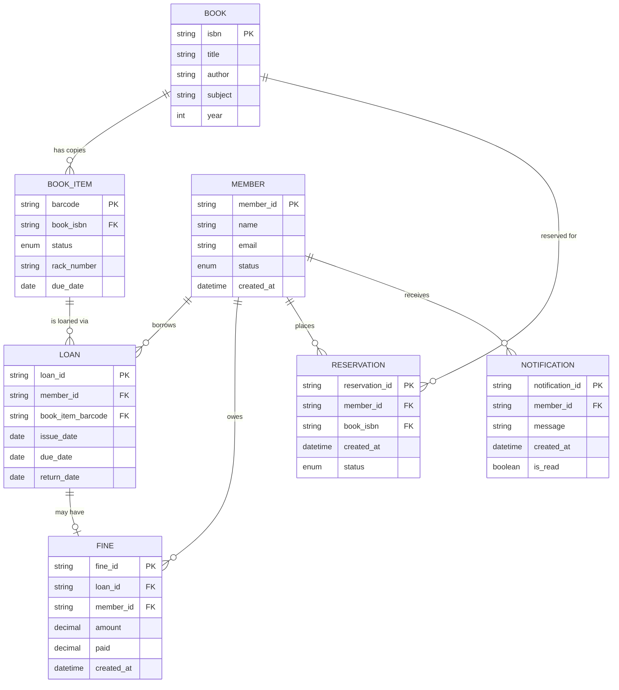

# Domain Model — Library Management System

## Entity Relationships

| Relationship | Type | Description |
|---|---|---|
| Book → BookItem | 1:N | One catalog record has multiple physical copies |
| Member → Loan | 1:N | A member can have multiple active loans (max 5) |
| BookItem → Loan | 1:N | A book item can be loaned multiple times over its lifetime |
| Loan → Fine | 1:0..1 | An overdue loan may generate one fine |
| Member → Reservation | 1:N | A member can have multiple reservations (max 5) |
| Member → Notification | 1:N | A member receives notifications about events |
