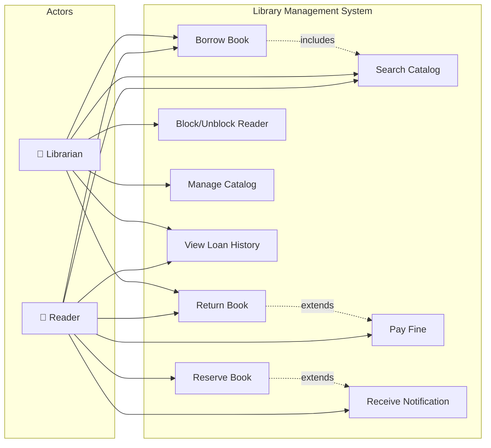

# Use Case Diagram — Library Management System

## Use Case Descriptions

| # | Use Case | Primary Actor | Description |
|---|----------|--------------|-------------|
| UC1 | Borrow Book | Reader/Librarian | Reader requests a book; system validates membership, limits, availability |
| UC2 | Return Book | Reader/Librarian | Book is returned; system calculates fine if overdue |
| UC3 | Search Catalog | Reader/Librarian | Search by title, author, ISBN, or subject |
| UC4 | Reserve Book | Reader | Place reservation on unavailable book (FIFO priority queue) |
| UC5 | Pay Fine | Reader | Pay outstanding fine; auto-unblock if balance cleared |
| UC6 | Receive Notification | Reader | Get notified when reserved book becomes available |
| UC7 | Block/Unblock Reader | Librarian | Block reader with high unpaid fines; unblock after payment |
| UC8 | Manage Catalog | Librarian | Add/update/remove books and physical copies |
| UC9 | View Loan History | Reader/Librarian | View active and past loans |
